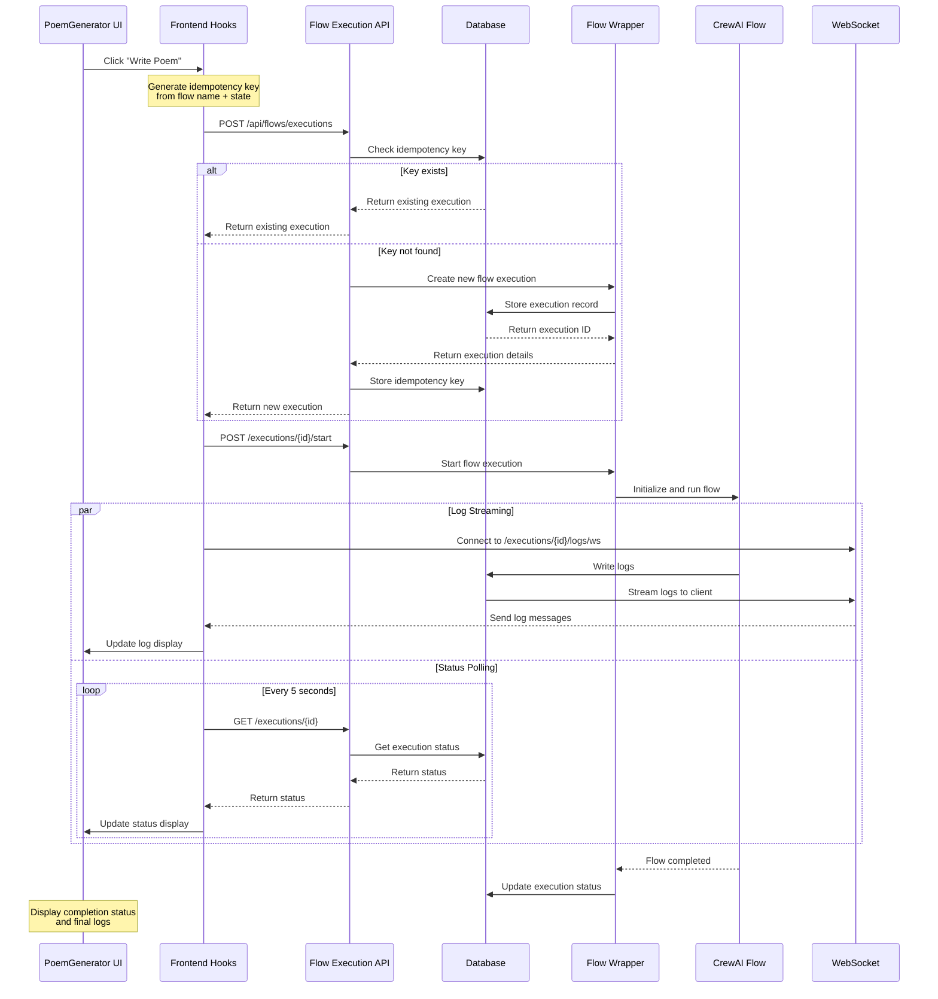

# Poem Generation Flow

This document explains the sequence of events that occur during poem generation in QuizMasterPro, from frontend interaction to backend execution.

## Overview

The poem generation process involves several components:
1. Frontend UI (PoemGenerator component)
2. Flow Execution API
3. Flow Wrapper
4. CrewAI Flow System
5. WebSocket Log Stream

## Sequence Diagram

## Detailed Flow Explanation

### 1. Initial Request
- User clicks "Write Poem" button in the PoemGenerator component
- Frontend generates an idempotency key based on:
  - Flow name ("poem")
  - Topic title and description
  - Timestamp (rounded to 5 seconds)
- Frontend sends POST request to create execution

### 2. Execution Creation
- Backend receives request with idempotency key
- Checks database for existing execution with same key
- If found, returns existing execution
- If not found:
  - Creates new flow execution record
  - Stores idempotency key in database
  - Returns execution details to frontend

### 3. Execution Start
- Frontend receives execution ID
- Sends request to start execution
- Backend initiates flow through FlowWrapper
- CrewAI flow begins execution

### 4. Parallel Processes
Two processes run concurrently:

#### Log Streaming
- Frontend establishes WebSocket connection
- CrewAI writes logs to database
- Logs are streamed in real-time through WebSocket
- Frontend updates UI with new log messages

#### Status Polling
- Frontend polls execution status every 5 seconds
- Backend checks database for current status
- UI updates progress bar and status display

### 5. Completion
- CrewAI flow completes
- FlowWrapper updates execution status
- Frontend receives final status
- UI displays completion state and final logs

## Error Handling

### Frontend
- Prevents multiple simultaneous executions
- Implements exponential backoff for WebSocket reconnection
- Displays user-friendly error messages
- Provides retry functionality

### Backend
- Validates all requests with JWT authentication
- Uses idempotency keys to prevent duplicate executions
- Implements proper error status codes
- Logs errors for debugging

## Important Considerations

1. **Idempotency**
   - Keys expire after 24 hours
   - Scoped to specific user
   - Based on flow input parameters

2. **State Management**
   - Frontend tracks execution state
   - Prevents concurrent executions
   - Handles disconnections gracefully

3. **Performance**
   - Logs streamed in real-time
   - Status polling rate limited
   - Database indexes for efficient queries

4. **Security**
   - All endpoints require authentication
   - User-scoped executions
   - Sanitized log output
